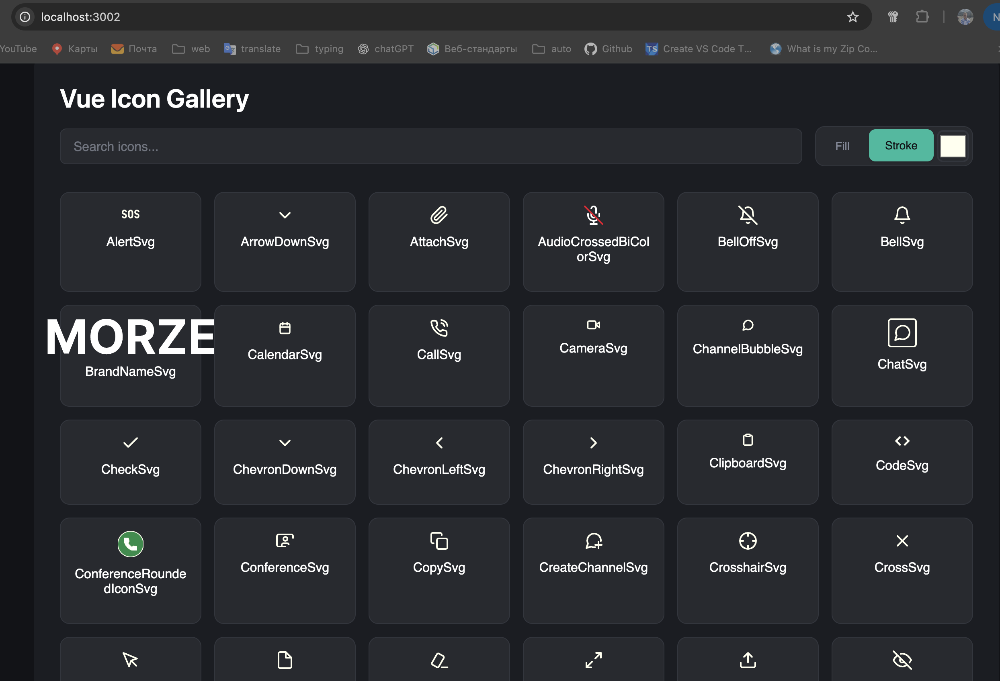

# 🎨 vue-icon-gallery

A simple plugin for previewing SVG icons in Vue projects. Displays actual icons from your folders, allows searching and quick fill/stroke color checking.

## Preview



## Requirements

- Vue 3
- Vite 7+
- Node.js 20+

## Installation

```bash
npm i -D vue-icon-gallery
```

## Usage (vite.config.ts)

```typescript
import { defineConfig } from 'vite'
import vue from '@vitejs/plugin-vue'
import { vueIconGallery } from 'vue-icon-gallery'

export default defineConfig({
  plugins: [
    vue(),
    vueIconGallery({
      iconsPath: ['src/components/app-svg', 'src/components/icons'], // Path to icons folder
      port: 3002, // (default: 3002)
      open: true // Automatically open browser, default: true
    })
  ]
})
```

Start the dev server as usual. The plugin will spin up a separate gallery server and output the URL to the console.

## How it works

- The plugin scans specified icon folders and starts a gallery server.
- The gallery displays found SVG files.
- Clicking copies the icon name.

## 🚀 Advantages

- ✅ **No impact on production build** - works only in dev mode
- ✅ **Automatic updates** - new icons appear without restart
- ✅ **Flexible configuration** - customizable paths and port

## License

MIT
